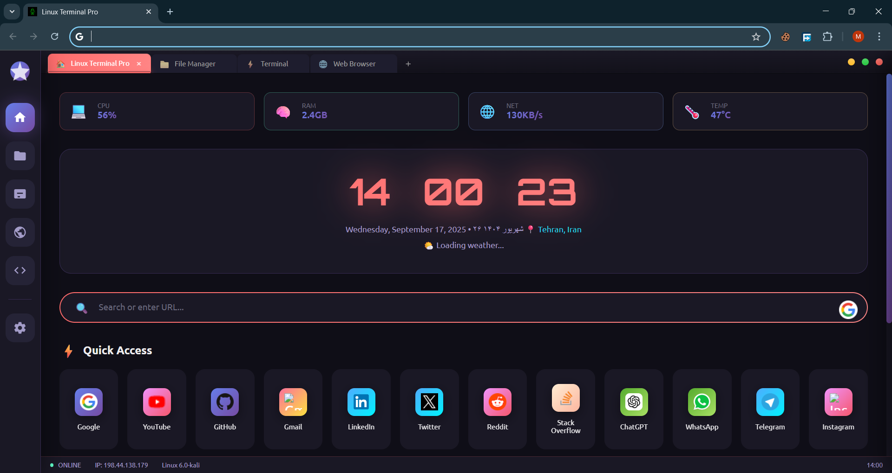

# Kali Linux Terminal Extension

[](https://github.com/mahdigodprogit/KaliLinuxTerminalExtension/releases)
[](LICENSE)

A Chrome **Manifest V3** extension that transforms your New Tab page into a **Kali Linux–inspired terminal dashboard**.

---

## 🚀 Features
- Dark terminal theme inspired by Kali Linux aesthetics  
- Clean, minimal dashboard look  
- Lightweight and fast (Manifest V3)  

---

## 📸 Screenshot
> Example of the extension in action:



---

## 📥 Installation

### Developer Mode (manual)
1. Download the latest ZIP from [Releases](https://github.com/mahdigodprogit/KaliLinuxTerminalExtension/releases).
2. Extract the archive.
3. In Chrome, open **Extensions** → enable **Developer mode** → click **Load unpacked**.
4. Select the extracted folder.

---

## 🛠 Development
Clone the repo and make changes locally:
```bash
git clone https://github.com/mahdigodprogit/KaliLinuxTerminalExtension.git
cd KaliLinuxTerminalExtension
